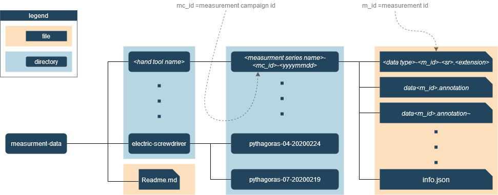

# Measurement Data

The measurement data repository is a collection of:
- _labeled_ data
- information about measurements
- plots, visualization of the data

In order to get things running:

1. Clone the repository

```
git clone https://github.com/mutschcr/tool-tracking.git
cd tool-tracking
```

2. Then you need to download the measurement data from an external host:
```
wget https://owncloud.fraunhofer.de/index.php/s/UOzJU8ypG3ZKKte/download -o electric_screwdriver.tar.gz
tar -xzvf electric_screwdriver.tar.gz

wget https://owncloud.fraunhofer.de/index.php/s/ZisA9yrSb0cwAmV/download -o pneumatic_riveting_gun.tar.gz
tar -xzvf pneumatic_riveting_gun.tar.gz

wget https://owncloud.fraunhofer.de/index.php/s/WOiEDXTOz2JgWCD/download -o pneumatic_screwdriver.tar.gz
tar -xzvf pneumatic_screwdriver.tar.gz
```

3. Setup a conda virtual environment and start Jupyter Notebook
```
conda env create -f environment.yml
conda activate mdenv
pip install seglearn
cd data_tools
python deploy.py
cd ..
python -m jupyter notebook
```

The mandatory structure of this repository is as follows:

  

You have one dedicated folder for each __(hand) tool__. On the next level are folders for each __measurement campaign__. The undermost level contains all __measurements__ of the corresponding measurement campaign.

The preferred way to access the data for analysis and learning is using the `datatools` package which is part of this repository. You can find more information about the usage of that package in the corresponding folder.
